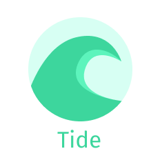
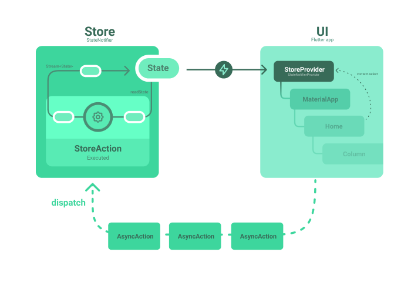

A very thin layer on top of [state_notifier](https://pub.dev/packages/state_notifier) and [provider](https://pub.dev/packages/provider) to give guidelines when architecturing an application.



## Quickstart

Define your application state class and its associated `Store`.

```dart
import 'package:tide/tide.dart';

class CounterState {
  const CounterState(this.value, this.isLoading);
  final int value;
  final bool isLoading;
}

class CounterStore extends Store<CounterState> {
  CounterStore() : super(initialState: CounterState(0, false));

  @override
  void onStateChanged(CounterState oldState) {
    print('State changed from ${oldState.value} to ${state.value}');
  }
}
```

Define a set of `AsyncActions` that will mutate the state from the store when dispatched.

```dart
import 'package:tide/tide.dart';

class Increment extends StoreAction<CounterState> {
  @override
  Stream<CounterState> execute(StateReader<CounterState> state,
      Dispatcher<CounterState> dispatch) async* {
    if (!state().isLoading) {
      yield CounterState(state().value + 1, false);
    }
  }
}

class AddServerValue extends StoreAction<CounterState> {
  @override
  Stream<CounterState> execute(StateReader<CounterState> state,
      Dispatcher<CounterState> dispatch) async* {
    if (!state().isLoading) {
      yield CounterState(state().value, true);
      final serverValue = await ServerClient().getValue();
      yield CounterState(state().value + serverValue, false);
    }
  }
}

class ResetThenAddValueverySecond extends StoreAction<CounterState> {
  const ResetThenAddValueverySecond(this.value);
  final int value;

  @override
  Stream<CounterState> execute(StateReader<CounterState> state,
      Dispatcher<CounterState> dispatch) async* {
    if (!state().isLoading) {
      yield CounterState(0, true);
      for (var i = 0; i < 5; i++) {
        await Future.delayed(const Duration(seconds: 1));
        yield CounterState(state().value + value, true);
      }
      yield CounterState(state().value, false);
    }
  }
}
```

Now your state can be provided through a `StoreProvider` at the root of your application, and accessed with the `BuildContext.select` extension method.

```dart
import 'package:flutter_tide/flutter_tide.dart';

class MyApp extends StatelessWidget {
  @override
  Widget build(BuildContext context) {
    return StoreProvider<CounterState>(
      createStore: (context) => Store<CounterState>(
        initialState: CounterState(0, false),
      ),
      child: MaterialApp(
        title: 'Tide Demo',
        theme: ThemeData(
          primarySwatch: Colors.blue,
        ),
        home: CounterPage(),
      ),
    );
  }
}

class CounterPage extends StatelessWidget {
  CounterPage({Key key}) : super(key: key);

  @override
  Widget build(BuildContext context) {
    final isLoading = context.select((CounterState state) => state.isLoading);
    return Scaffold(
      appBar: AppBar(
        title: Text('Tide'),
      ),
      body: Center(
        child: isLoading ? Center(child: CircularProgressIndicator()) : Count(),
      ),
      floatingActionButton: Row(
        mainAxisAlignment: MainAxisAlignment.center,
        children: [
          FloatingActionButton(
            onPressed: () => context.dispatch(Increment()),
            tooltip: 'Increment',
            child: Icon(Icons.add),
          ),
          FloatingActionButton(
            onPressed: () => context.dispatch(AddServerValue()),
            tooltip: 'AddServerValue',
            child: Icon(Icons.arrow_downward),
          ),
          FloatingActionButton(
            onPressed: () => context.dispatch(ResetThenAddValueverySecond(10)),
            tooltip: 'ResetThenAddValueverySecond',
            child: Icon(Icons.alarm_add),
          ),
        ],
      ), // This trailing comma makes auto-formatting nicer for build methods.
    );
  }
}

class Count extends StatelessWidget {
  const Count({
    Key key,
  }) : super(key: key);

  @override
  Widget build(BuildContext context) {
    final count = context.select((CounterState state) => state.value);
    return Column(
      mainAxisAlignment: MainAxisAlignment.center,
      children: <Widget>[
        Text(
          'You have pushed the button this many times:',
        ),
        Text(
          '$count',
          style: Theme.of(context).textTheme.headline4,
        ),
      ],
    );
  }
}
```

## Q&A

> Why publishing only a few classes and defining them as a new *"state-management"* solution ?

Yes, tide is just a StoreNotifier, but because I copy paste those classes in every one of my projects. And it adds a few guidelines on how to architecture the application, which makes it easier to share.

> What are the differences with redux ?

Redux has almost the same concepts than tide. But I've founded that it introduced too much boilerplate by having asynchronous (*Thunks*) and synchronous actions. Moreover most of the logic was splitted between synchronous reducers and asynchronous thunks. I like more the usage of `Streams` and generators for emitting multiple updates (like in flutter_bloc) instead of a setter too.

> Why not simply using a StateNotifier with methods instead of actions ?

Since I like the idea of having a single state (having a single state for the application has the advantage of being able to tackle concurrency errors and track dependencies) for the whole application, it can become a mess. And having classes for actions gives you the ability to trace every action, which helps for debugging.

> What are the differences with flutter_bloc ?

FLutter bloc has a different architecture, where a multiple blocs are representing portions of the logic where events (Actions) are filtered in. It is not ideal when working with a single state.